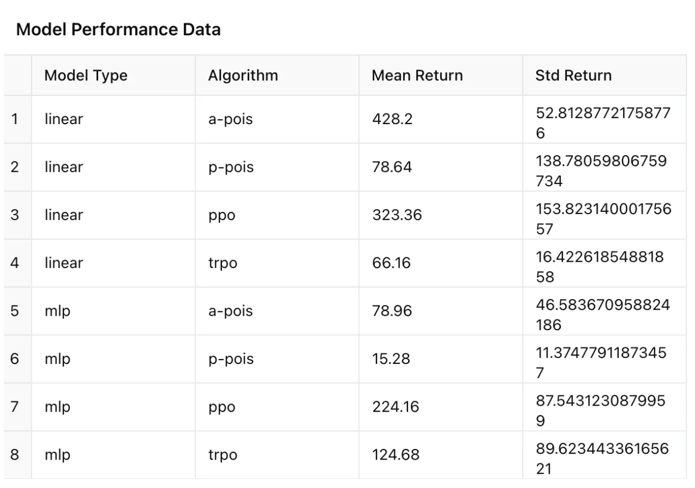

# RL_baselines
Custom implementation of unavailable baseline algorithms.

Currently available pytorch implementations -
+ POIS (Policy Optimization via Importance Sampling) - [paper](https://proceedings.neurips.cc/paper/2018/file/6aed000af86a084f9cb0264161e29dd3-Paper.pdf)

In progress - 
+ Minimum-Variance Policy Evaluation for Policy Improvement - [paper](https://proceedings.mlr.press/v216/metelli23a/metelli23a.pdf)

## Installation
``pip install -r requirements.txt``

## Replicating POIS results -

1. ``python evaluate_pois.py``

## Results for 500 iterations

We show evaluation results against PPO and TRPO in the linear Gaussian and MLP Gaussian Policy with learnable mean and fixed variance.

